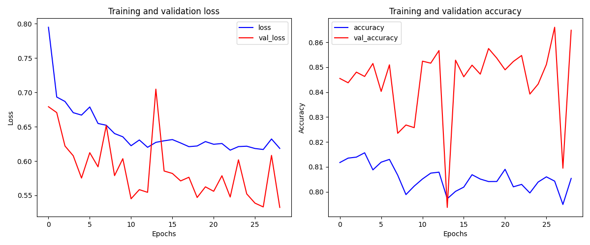

# FeelingDetection

El objetivo de este proyecto será crear una red neuronal capaz de identificar si una reseña de una película en IMDB es positiva (1) o negativa (0).

Para ello utilizaremos el conjunto de datos provisto por la librería `Keras`, específicamente `keras.datasets.imdb`.

La idea de este proyecto surge de la necesidad de practicar y jugar un poco con redes neuronales.

Se utilizará una **fully connected network** tipo **MLP** para este ejercicio. La cantidad de capas y neuronas se irá decidiendo a medida que vayamos probando.

Luego, se utilizará como función de activación `Relu` en las *hidden layers* y `Sigmoid` en la neurona del *output layer* al ser un problema de clasificación.


## Preprocesamiento

Longitud del dataset completo : `50000`

El dataset esta compuesto por resenias y un target que representa si la resenia es positiva (1) o negativa (0).


Cada resenia tiene el siguiente formato:

```
[1, 5, 198, 138, 254, 8, 967, 10, 10, 39, 4, 1158, 213, 7, 650, 7660, 1475, 213, 7, 650, 13, 215, 135, 13, 1583, 754, 2359, 133, 252, 50, 9, 49, 1104, 136, 32, 4, 1109, 304, 133, 1812, 21, 15, 191, 607, 4, 910, 552, 7, 229, 5, 226, 20, 198, 138, 10, 10, 241, 46, 7, 158]
```

Un vector de longitud **variable** que representa la resenia. Cada numero representa una palabra.

En este contexto, los numeros que representan a las palabras, nacen de la frecuencia de aparicion en el dataset. Un indice n representa que la palabra es la n-esima palabra mas frecuente, lo que quiere decir que, **todas las palabras tienen indices diferentes**.

Ademas, keras te permite a traves del parametro `num_words` en el metodo `.load_data()`, controlar la riqueza del vocabulario, ya que, con `num_words` especificas la cantidad maxima de palabras unicas, dada su frecuencia de aparicion, ejemplo:

Si `num_words = 10.000`, estaran las palabras cuyo indice de aparicion sea `<= 10.000`, mayor riqueza del vocabulario, registros mas nutritivos para la red.

Si `num_words = 2`, estaran las palabras cuyo indice de aparicion sea `<= 2`, menor riqueza, registros menos nutritivos.

Cabe destacar que, el modificar el `num_words` no cambiara la logintud promedio de las resenias, simplemente, las palabras que no entren dentro del rango establecido por `num_words` seran cambiadas por un numero reservado, en este caso **2**.

Empezaremos utilizando `num_words = 15.000`.

Luego, a traves del siguiente codigo:

```
from sklearn.model_selection import train_test_split
import numpy as np


def split_dataset(X_train, Y_train, X_test, Y_test):
    """
        25.000 registros para test-validacion es demasiado,
        esta funcion junta los datos retornados por .load_data
        los une y luego los divide a traves de train_test_split
    """

    X_data = np.concatenate((X_train, X_test), axis=0)
    Y_data = np.concatenate((Y_train, Y_test), axis=0)

    X_train, X_test, Y_train, Y_test = train_test_split(X_data, Y_data, random_state=42, stratify=Y_data, test_size=.3)
    X_test, X_val, Y_test, Y_val = train_test_split(X_test, Y_test, random_state=42, stratify=Y_test, test_size=.5)

    return ((X_train, Y_train), (X_test, Y_test), (X_val, Y_val))

```

Redividimos el conjunto, para hacer que el `X_train` tuviese 35.000 y `val + test` 15.000 (50/50).


Luego, tuvimos que hacer que todas las resenias tuviesen la misma longitud, esto lo hicimos a traves de la funcion `pad_sequences`:

```
from keras.preprocessing.sequence import pad_sequences
from sklearn.preprocessing import Normalizer
import numpy as np

def preprocess_data(X_train, X_test, X_val, pad_length):
    """
        Recibe los conjuntos retornados por keras.datasets.imdb
        y aplica los preprocesamientos necesarios
    """
    X_train = pad_sequences(X_train, maxlen=pad_length, padding="post", truncating="post")
    X_test = pad_sequences(X_test, maxlen=pad_length, padding="post", truncating="post")
    X_val = pad_sequences(X_val, maxlen=pad_length, padding="post", truncating="post")
    X_train = np.array(X_train).astype("float32")
    X_test = np.array(X_test).astype("float32")
    X_val = np.array(X_val).astype("float32")

    scaler = Normalizer()
    X_train = scaler.fit_transform(X_train)
    X_test = scaler.transform(X_test)
    X_val = scaler.transform(X_test)
    return X_train, X_test, X_val

```

Basicamente, todas las resenias con una longitud menor a `pad_length` se rellena con 0s.

Todas las resenias con una longitud mayor a `pad_length` se cortan.

El valor de `pad_length` a utilizar (en principio), sera **600**. Despues de investigar, vimos que **600 es el valor de percentil 95 para las longitudes de las resenias**.

```

# codigo

(X_train, Y_train), (X_test, Y_test) = datasets.imdb.load_data(num_words=15_000)
lengths = [len(i) for i in X_train]+[len(i) for i in X_test]
print(np.percentile(lengths, 95))

# salida

598.0

```

Ademas, normalizamos de una vez.


```
# codigo del main.py antes de hypertunning

from tensorflow.keras import datasets
from utils.preprocess_data import preprocess_data
from utils.split_dataset import split_dataset
import matplotlib.pyplot as plt
from keras_tuner import Hyperband 
from utils.model_builder import model_builder
import numpy as np


(X_train, Y_train), (X_test, Y_test) = datasets.imdb.load_data(num_words=15_000)
(X_train, Y_train), (X_test, Y_test), (X_val, Y_val) = split_dataset(X_train, Y_train, X_test, Y_test)
X_train, X_test, X_val = preprocess_data(X_train, X_test, X_val, pad_length=600)

```


## Primer intento de entrenamiento

Despues de ejecutar las primeras pruebas de hypertunning utilizando `keras_tuner` y `Hyperband` como algoritmo de busqueda, atraves del siguiente codigo:

```
# main.py

from tensorflow.keras import datasets
from utils.preprocess_data import preprocess_data
from utils.split_dataset import split_dataset
import matplotlib.pyplot as plt
from keras_tuner import Hyperband 
from utils.model_builder import model_builder
import numpy as np


res_len = 600
(X_train, Y_train), (X_test, Y_test) = datasets.imdb.load_data(num_words=15_000)
(X_train, Y_train), (X_test, Y_test), (X_val, Y_val) = split_dataset(X_train, Y_train, X_test, Y_test)
X_train, X_test, X_val = preprocess_data(X_train, X_test, X_val, pad_length=res_len)


tuner = Hyperband(
    model_builder(res_len),
    factor=3,
    max_epochs=20,
    objective="val_precision",
    directory="train_results",
    project_name="FeelingsDetection"
)

tuner.search(
    X_train,
    Y_train,
    validation_data=(X_val, Y_val)
)


# utils/model_builder.py

from tensorflow import keras
from keras import layers, metrics

def model_builder(res_len):
    def clousure(hp):
        net = keras.Sequential()

        n_hidden_layers = hp.Int('n_hidden_layers', min_value=1, max_value=5, step=1)
        learning_rate = hp.Choice('learning_rate', values=[1e-2, 1e-3, 1e-4, 1e-5])

        net.add(layers.InputLayer(shape=(res_len,)))

        # busqueda de numero de capas optimo
        for i in range(n_hidden_layers):
            n_units = hp.Int(f'units_for_{i}', min_value=24, max_value=600, step=24)

            # busqueda de numero de neuronas optimo por capa
            net.add(layers.Dense(units=n_units, activation="relu"))

        net.add(layers.Dense(units=1, activation='sigmoid'))

        net.compile(
            loss="crossentropy",
            optimizer=keras.optimizers.Adam(learning_rate=learning_rate),
            metrics=['accuracy', 'precision']
        )
        return net
    return clousure


```

Obtuvimos los siguientes resultados:

```
Trial 26 Complete [00h 02m 09s]
val_precision: 0.5098376870155334

Best val_precision So Far: 0.513620913028717
Total elapsed time: 00h 24m 18s
```

Resultados realmente lamentables.

Seguramente el problema se esta dando en la representacion de los datos: el formato utilizado para nutrir a la red con las resenias no esta siendo lo suficientemente explicativo.


## Vectorizacion

Despues de investigar, vimos que una forma factible de representar las resenias es la siguiente:

Teniendo en cuenta que las resenias son vectores compuestos por numeros, donde cada numero representa una palabra **diferente**, cada resenia se convertira en un vector de 15.000 valores, donde los indices de las palabras que aparecen en la resenia se convertiran en un 1 y todo el resto del vector sera un 0.

Ej:

```
Resenia original : [6, 4, 3]
Resenia convertida: [0,0,0,1,1,0,1,...]
```

De este modo, cada nuevo vector representara las palabras que contiene cada resenia.


Utilizando el siguiente codigo, preprocesamos de nuevo los datasets:

```

# utils/preprocess_data.py


from keras.preprocessing.sequence import pad_sequences
from sklearn.preprocessing import Normalizer
import numpy as np


def vectorize(seqs, num_words):
    """
        Convierte los conjuntos de resenias para que cada resenia
        sea un vector de num_words dimensiones relleno de 0s,
        pero con 1s en los indices equivalenes a los valores de las
        palabras contenidas en la resenia original

        ej:

        Resenia original : [6, 4, 3]
        Resenia convertida: [0,0,0,1,1,0,1,...]
    """
    results = np.zeros((len(seqs), num_words))
    for i, seq in enumerate(seqs):
        results[i, seq] = 1.
    return results

def preprocess_data(X_train, X_test, X_val, num_words):
    """
        Recibe los conjuntos retornados por keras.datasets.imdb
        y aplica los preprocesamientos necesarios
    """
    X_train = vectorize(X_train, num_words)
    X_test = vectorize(X_test, num_words)
    X_val = vectorize(X_val, num_words)
    return X_train, X_test, X_val

# main.py

from tensorflow.keras import datasets
from utils.preprocess_data import preprocess_data
from utils.split_dataset import split_dataset
import matplotlib.pyplot as plt
from keras_tuner import Hyperband 
from utils.model_builder import model_builder
import numpy as np


num_words = 10_000
(X_train, Y_train), (X_test, Y_test) = datasets.imdb.load_data(num_words=num_words)
(X_train, Y_train), (X_test, Y_test), (X_val, Y_val) = split_dataset(X_train, Y_train, X_test, Y_test)
X_train, X_test, X_val = preprocess_data(X_train, X_test, X_val, num_words=num_words)
```

## Segundo intento de entrenamiento

Luego, utilizando el siguiente codigo:

```

# utils/model_builder.py

from tensorflow import keras
from keras import layers, metrics

def model_builder(num_words):
    def clousure(hp):
        net = keras.Sequential()

        n_hidden_layers = hp.Int('n_hidden_layers', min_value=1, max_value=5, step=1)
        learning_rate = hp.Choice('learning_rate', values=[1e-2, 1e-3, 1e-4, 1e-5])

        net.add(layers.InputLayer(shape=(num_words,)))

        # busqueda de numero de capas optimo
        for i in range(n_hidden_layers):
            n_units = hp.Int(f'units_for_{i}', min_value=24, max_value=600, step=24)

            # busqueda de numero de neuronas optimo por capa
            net.add(layers.Dense(units=n_units, activation="relu"))

        net.add(layers.Dense(units=1, activation='sigmoid'))

        net.compile(
            loss="crossentropy",
            optimizer=keras.optimizers.Adam(learning_rate=learning_rate),
            metrics=['accuracy', 'precision']
        )
        return net
    return clousure

# main.py


from tensorflow.keras import datasets
from utils.preprocess_data import preprocess_data
from utils.split_dataset import split_dataset
import matplotlib.pyplot as plt
from keras_tuner import Hyperband 
from utils.model_builder import model_builder
import numpy as np


num_words = 10_000
(X_train, Y_train), (X_test, Y_test) = datasets.imdb.load_data(num_words=num_words)
(X_train, Y_train), (X_test, Y_test), (X_val, Y_val) = split_dataset(X_train, Y_train, X_test, Y_test)
X_train, X_test, X_val = preprocess_data(X_train, X_test, X_val, num_words=num_words)


tuner = Hyperband(
    model_builder(num_words),
    factor=3,
    max_epochs=20,
    objective="val_precision",
    directory="train_results",
    project_name="FeelingsDetection"
)

tuner.search(
    X_train,
    Y_train,
    validation_data=(X_val, Y_val)
)

```

Cabe destacar que modificamos el valor de `num_words = 10.000`, basicamente por que con 15.000 mi pc no podia.

Obtuvimos los siguientes resultados:

```
Mejor configuracion de hiperparametros 
{'n_hidden_layers': 5, 'learning_rate': 0.01, 'units_for_0': 360, 'units_for_1': 456, 'units_for_2': 528, 'units_for_3': 360, 'units_for_4': 216, 'tuner/epochs': 7, 'tuner/initial_epoch': 3, 'tuner/bracket': 2, 'tuner/round': 1, 'tuner/trial_id': '0010'}
Epoch 1/20
1094/1094 ━━━━━━━━━━━━━━━━━━━━ 44s 39ms/step - accuracy: 0.8214 - loss: 0.4399 - precision: 0.8164 - val_accuracy: 0.8681 - val_loss: 0.3058 - val_precision: 0.8155
Epoch 2/20
1094/1094 ━━━━━━━━━━━━━━━━━━━━ 42s 39ms/step - accuracy: 0.9225 - loss: 0.2095 - precision: 0.9191 - val_accuracy: 0.8899 - val_loss: 0.2986 - val_precision: 0.8837
Epoch 3/20
1094/1094 ━━━━━━━━━━━━━━━━━━━━ 42s 39ms/step - accuracy: 0.9428 - loss: 0.1591 - precision: 0.9404 - val_accuracy: 0.8791 - val_loss: 0.3802 - val_precision: 0.9177
Epoch 4/20
1094/1094 ━━━━━━━━━━━━━━━━━━━━ 42s 39ms/step - accuracy: 0.9476 - loss: 0.1463 - precision: 0.9458 - val_accuracy: 0.8775 - val_loss: 0.3363 - val_precision: 0.8664
Epoch 5/20
1094/1094 ━━━━━━━━━━━━━━━━━━━━ 43s 39ms/step - accuracy: 0.9689 - loss: 0.0989 - precision: 0.9709 - val_accuracy: 0.8743 - val_loss: 0.3406 - val_precision: 0.8437
Epoch 6/20
1094/1094 ━━━━━━━━━━━━━━━━━━━━ 42s 39ms/step - accuracy: 0.9828 - loss: 0.0653 - precision: 0.9815 - val_accuracy: 0.8771 - val_loss: 0.5027 - val_precision: 0.8648
Epoch 7/20
1094/1094 ━━━━━━━━━━━━━━━━━━━━ 42s 39ms/step - accuracy: 0.9895 - loss: 0.0455 - precision: 0.9882 - val_accuracy: 0.8697 - val_loss: 0.5548 - val_precision: 0.8728
Epoch 8/20
1094/1094 ━━━━━━━━━━━━━━━━━━━━ 43s 39ms/step - accuracy: 0.9863 - loss: 0.0556 - precision: 0.9856 - val_accuracy: 0.8677 - val_loss: 0.5178 - val_precision: 0.8407
Epoch 9/20
1094/1094 ━━━━━━━━━━━━━━━━━━━━ 42s 39ms/step - accuracy: 0.9873 - loss: 0.0706 - precision: 0.9866 - val_accuracy: 0.8685 - val_loss: 1.4311 - val_precision: 0.8595
Epoch 10/20
1094/1094 ━━━━━━━━━━━━━━━━━━━━ 43s 39ms/step - accuracy: 0.9939 - loss: 0.0361 - precision: 0.9932 - val_accuracy: 0.8647 - val_loss: 0.6513 - val_precision: 0.8371
Epoch 11/20
1094/1094 ━━━━━━━━━━━━━━━━━━━━ 43s 39ms/step - accuracy: 0.9963 - loss: 0.0172 - precision: 0.9951 - val_accuracy: 0.8627 - val_loss: 0.7688 - val_precision: 0.8257
Epoch 12/20
1094/1094 ━━━━━━━━━━━━━━━━━━━━ 42s 39ms/step - accuracy: 0.9957 - loss: 0.0352 - precision: 0.9945 - val_accuracy: 0.8655 - val_loss: 0.8586 - val_precision: 0.8258
Epoch 13/20
1094/1094 ━━━━━━━━━━━━━━━━━━━━ 42s 39ms/step - accuracy: 0.9941 - loss: 0.0193 - precision: 0.9930 - val_accuracy: 0.8671 - val_loss: 1.5382 - val_precision: 0.8507
Epoch 14/20
1094/1094 ━━━━━━━━━━━━━━━━━━━━ 42s 38ms/step - accuracy: 0.9967 - loss: 0.0197 - precision: 0.9962 - val_accuracy: 0.8712 - val_loss: 17.5349 - val_precision: 0.8531
Epoch 15/20
1094/1094 ━━━━━━━━━━━━━━━━━━━━ 44s 40ms/step - accuracy: 0.9927 - loss: 0.1041 - precision: 0.9915 - val_accuracy: 0.8607 - val_loss: 0.9648 - val_precision: 0.8285
Epoch 16/20
1094/1094 ━━━━━━━━━━━━━━━━━━━━ 45s 41ms/step - accuracy: 0.9982 - loss: 0.0081 - precision: 0.9976 - val_accuracy: 0.8651 - val_loss: 1.0509 - val_precision: 0.8428
Epoch 17/20
1094/1094 ━━━━━━━━━━━━━━━━━━━━ 51s 46ms/step - accuracy: 0.9987 - loss: 0.0063 - precision: 0.9980 - val_accuracy: 0.8672 - val_loss: 1.4332 - val_precision: 0.8538
Epoch 18/20
1094/1094 ━━━━━━━━━━━━━━━━━━━━ 43s 40ms/step - accuracy: 0.9965 - loss: 0.0153 - precision: 0.9957 - val_accuracy: 0.8659 - val_loss: 1.1646 - val_precision: 0.8661
Epoch 19/20
1094/1094 ━━━━━━━━━━━━━━━━━━━━ 45s 41ms/step - accuracy: 0.9814 - loss: 0.3687 - precision: 0.9773 - val_accuracy: 0.8585 - val_loss: 1.1425 - val_precision: 0.8205
Epoch 20/20
1094/1094 ━━━━━━━━━━━━━━━━━━━━ 46s 42ms/step - accuracy: 0.9581 - loss: 0.3564 - precision: 0.9293 - val_accuracy: 0.8252 - val_loss: 3.9447 - val_precision: 0.7567

```
Mejor precision para conjunto de validacion : **91,77%**


Como vemos, resultados no muy estables pero bastante mejores que los anteriores.

## Tercer intento de entrenamiento

En el proximo intento, haremos los siguientes cambios:

1- Para la representacion de los datos, ahora el vector de 10.000 elementos que representa la resenia, no solo contendra un 1 en los indices de las palabras que aparecen, sino que tendra un numero que represente la cantidad de veces que aparece la palabra en la resenia. 

2- Implementaremos tecnicas de regularizacion, en este caso, l2 y Dropout.

Utilizando el siguiente codigo:

```
# utils/preprocess_data.py

from keras.preprocessing.sequence import pad_sequences
from sklearn.preprocessing import Normalizer
import numpy as np
from collections import Counter


def vectorize(seqs, num_words):
    """
        Convierte los conjuntos de resenias para que cada resenia
        sea un vector de num_words dimensiones relleno de 0s,
        pero con 1s en los indices equivalenes a los valores de las
        palabras contenidas en la resenia original

        ej:

        Resenia original : [6, 4, 3]
        Resenia convertida: [0,0,0,1,1,0,1,...]
    """
    results = np.zeros((len(seqs), num_words))
    for i, seq in enumerate(seqs):
        for a in seq:
            results[i, a] += 1.
    return results

def preprocess_data(X_train, X_test, X_val, num_words):
    """
        Recibe los conjuntos retornados por keras.datasets.imdb
        y aplica los preprocesamientos necesarios
    """
    X_train = vectorize(X_train, num_words)
    X_test = vectorize(X_test, num_words)
    X_val = vectorize(X_val, num_words)
    return X_train, X_test, X_val

# utils/model_builder.py

from tensorflow import keras
from keras import layers, metrics
from keras import regularizers

def model_builder(num_words):
    def clousure(hp):
        net = keras.Sequential()

        n_hidden_layers = hp.Int('n_hidden_layers', min_value=1, max_value=3, step=1)
        learning_rate = hp.Choice('learning_rate', values=[1e-2, 1e-3, 1e-4])

        net.add(layers.InputLayer(shape=(num_words,)))

        # busqueda de numero de capas optimo
        for i in range(n_hidden_layers):
            n_units = hp.Int(f'units_for_{i}', min_value=48, max_value=576, step=24)
            regu_const_value = hp.Choice(f'regu_const_{i}', values=[1e-1, 1e-2, 1e-3])
            dropout_rate = hp.Float(f'drop_rate_{i}', min_value=0.1, max_value=0.5, step=0.05)

            # busqueda de numero de neuronas optimo por capa
            net.add(layers.Dense(
                units=n_units, 
                activation="relu", 
                kernel_regularizer=regularizers.l2(regu_const_value)))
            net.add(layers.Dropout(rate=dropout_rate))

        net.add(layers.Dense(units=1, activation='sigmoid'))

        net.compile(
            loss="crossentropy",
            optimizer=keras.optimizers.Adam(learning_rate=learning_rate),
            metrics=['accuracy', 'precision']
        )
        return net
    return clousure

# main.py

from tensorflow.keras import datasets
from utils.preprocess_data import preprocess_data
from utils.show_train_results import show_train_results
from utils.split_dataset import split_dataset
import matplotlib.pyplot as plt
from keras_tuner import Hyperband 
from utils.model_builder import model_builder
import numpy as np


num_words = 10_000
(X_train, Y_train), (X_test, Y_test) = datasets.imdb.load_data(num_words=num_words)
(X_train, Y_train), (X_test, Y_test), (X_val, Y_val) = split_dataset(X_train, Y_train, X_test, Y_test)
X_train, X_test, X_val = preprocess_data(X_train, X_test, X_val, num_words=num_words)


tuner = Hyperband(
    model_builder(num_words),
    factor=2,
    max_epochs=15,
    objective="val_precision",
    directory="train_results",
    project_name="FeelingsDetection"
)

tuner.search(
    X_train,
    Y_train,
    validation_data=(X_val, Y_val)
)

best_hps = tuner.get_best_hyperparameters(num_trials=1)[0]
print("Mejor configuracion de hiperparametros ")
print(best_hps.values)

model = tuner.hypermodel.build(best_hps)
history = model.fit(
    X_train, Y_train,
    validation_data=(X_val, Y_val),
    epochs=20,  # Puedes ajustar según los resultados del tuner
)

show_train_results(history)

```

Obtuvimos los siguientes resultados:

```
Mejor configuracion de hiperparametros 
{'n_hidden_layers': 1, 'learning_rate': 0.0001, 'units_for_0': 456, 'regu_const_0': 0.01, 'drop_rate_0': 0.35, 'units_for_1': 216, 'regu_const_1': 0.1, 'drop_rate_1': 0.25, 'units_for_2': 384, 'regu_const_2': 0.01, 'drop_rate_2': 0.5, 'tuner/epochs': 15, 'tuner/initial_epoch': 0, 'tuner/bracket': 0, 'tuner/round': 0}
Epoch 1/20
1094/1094 ━━━━━━━━━━━━━━━━━━━━ 61s 55ms/step - accuracy: 0.7642 - loss: 3.0093 - precision: 0.7654 - val_accuracy: 0.8699 - val_loss: 0.5064 - val_precision: 0.8349
Epoch 2/20
1094/1094 ━━━━━━━━━━━━━━━━━━━━ 60s 55ms/step - accuracy: 0.8686 - loss: 0.4903 - precision: 0.8637 - val_accuracy: 0.8752 - val_loss: 0.4537 - val_precision: 0.8410
Epoch 3/20
1094/1094 ━━━━━━━━━━━━━━━━━━━━ 60s 55ms/step - accuracy: 0.8789 - loss: 0.4393 - precision: 0.8716 - val_accuracy: 0.8785 - val_loss: 0.4344 - val_precision: 0.8523
Epoch 4/20
1094/1094 ━━━━━━━━━━━━━━━━━━━━ 60s 55ms/step - accuracy: 0.8829 - loss: 0.4259 - precision: 0.8771 - val_accuracy: 0.8829 - val_loss: 0.4193 - val_precision: 0.8825
Epoch 5/20
1094/1094 ━━━━━━━━━━━━━━━━━━━━ 60s 55ms/step - accuracy: 0.8851 - loss: 0.4159 - precision: 0.8812 - val_accuracy: 0.8831 - val_loss: 0.4161 - val_precision: 0.8647
Epoch 6/20
1094/1094 ━━━━━━━━━━━━━━━━━━━━ 60s 55ms/step - accuracy: 0.8867 - loss: 0.4052 - precision: 0.8807 - val_accuracy: 0.8825 - val_loss: 0.4109 - val_precision: 0.8679
Epoch 7/20
1094/1094 ━━━━━━━━━━━━━━━━━━━━ 60s 55ms/step - accuracy: 0.8872 - loss: 0.4011 - precision: 0.8821 - val_accuracy: 0.8848 - val_loss: 0.4084 - val_precision: 0.9095
Epoch 8/20
1094/1094 ━━━━━━━━━━━━━━━━━━━━ 60s 55ms/step - accuracy: 0.8925 - loss: 0.3951 - precision: 0.8874 - val_accuracy: 0.8881 - val_loss: 0.3932 - val_precision: 0.8870
Epoch 9/20
1094/1094 ━━━━━━━━━━━━━━━━━━━━ 60s 55ms/step - accuracy: 0.8925 - loss: 0.3876 - precision: 0.8885 - val_accuracy: 0.8881 - val_loss: 0.3926 - val_precision: 0.8854
Epoch 10/20
1094/1094 ━━━━━━━━━━━━━━━━━━━━ 60s 55ms/step - accuracy: 0.8935 - loss: 0.3795 - precision: 0.8884 - val_accuracy: 0.8871 - val_loss: 0.3928 - val_precision: 0.8736
Epoch 11/20
1094/1094 ━━━━━━━━━━━━━━━━━━━━ 61s 55ms/step - accuracy: 0.8946 - loss: 0.3792 - precision: 0.8899 - val_accuracy: 0.8896 - val_loss: 0.3872 - val_precision: 0.8710
Epoch 12/20
1094/1094 ━━━━━━━━━━━━━━━━━━━━ 60s 55ms/step - accuracy: 0.8956 - loss: 0.3733 - precision: 0.8912 - val_accuracy: 0.8865 - val_loss: 0.3883 - val_precision: 0.8626
Epoch 13/20
1094/1094 ━━━━━━━━━━━━━━━━━━━━ 60s 55ms/step - accuracy: 0.9005 - loss: 0.3647 - precision: 0.8963 - val_accuracy: 0.8931 - val_loss: 0.3841 - val_precision: 0.8990
Epoch 14/20
1094/1094 ━━━━━━━━━━━━━━━━━━━━ 60s 55ms/step - accuracy: 0.9014 - loss: 0.3603 - precision: 0.8966 - val_accuracy: 0.8888 - val_loss: 0.3931 - val_precision: 0.9173
Epoch 15/20
1094/1094 ━━━━━━━━━━━━━━━━━━━━ 60s 55ms/step - accuracy: 0.9043 - loss: 0.3543 - precision: 0.9017 - val_accuracy: 0.8877 - val_loss: 0.3830 - val_precision: 0.8881
Epoch 16/20
1094/1094 ━━━━━━━━━━━━━━━━━━━━ 60s 55ms/step - accuracy: 0.9031 - loss: 0.3552 - precision: 0.8990 - val_accuracy: 0.8897 - val_loss: 0.3852 - val_precision: 0.9116
Epoch 17/20
1094/1094 ━━━━━━━━━━━━━━━━━━━━ 60s 55ms/step - accuracy: 0.9080 - loss: 0.3465 - precision: 0.9030 - val_accuracy: 0.8897 - val_loss: 0.3780 - val_precision: 0.8839
Epoch 18/20
1094/1094 ━━━━━━━━━━━━━━━━━━━━ 60s 55ms/step - accuracy: 0.9110 - loss: 0.3401 - precision: 0.9077 - val_accuracy: 0.8931 - val_loss: 0.3726 - val_precision: 0.8891
Epoch 19/20
1094/1094 ━━━━━━━━━━━━━━━━━━━━ 60s 55ms/step - accuracy: 0.9078 - loss: 0.3411 - precision: 0.9029 - val_accuracy: 0.8896 - val_loss: 0.3758 - val_precision: 0.9076
Epoch 20/20
1094/1094 ━━━━━━━━━━━━━━━━━━━━ 60s 55ms/step - accuracy: 0.9114 - loss: 0.3358 - precision: 0.9082 - val_accuracy: 0.8893 - val_loss: 0.3727 - val_precision: 0.8794
```


Mejor precision para conjunto de validacion : **91,73%**

## 4to intento

Para este 4to intento, implementaremos las siguientes modificaciones:

1- Reducir el espacio de busqueda de capas a [1,2]\
2- Reducir espacio de busqueda para `dropout_rate` a <= 4

Obtuvimos los siguientes resultados:


```
Mejor configuracion de hiperparametros 
{'n_hidden_layers': 1, 'learning_rate': 0.01, 'units_for_0': 240, 'regu_const_0': 0.001, 'drop_rate_0': 0.25, 'units_for_1': 336, 'regu_const_1': 0.1, 'drop_rate_1': 0.30000000000000004, 'tuner/epochs': 15, 'tuner/initial_epoch': 0, 'tuner/bracket': 0, 'tuner/round': 0}

Epoch 1/30
1094/1094 ━━━━━━━━━━━━━━━━━━━━ 39s 35ms/step - accuracy: 0.7975 - loss: 0.8926 - precision: 0.7928 - val_accuracy: 0.8455 - val_loss: 0.6791 - val_precision: 0.8035
Epoch 2/30
1094/1094 ━━━━━━━━━━━━━━━━━━━━ 39s 36ms/step - accuracy: 0.8158 - loss: 0.7013 - precision: 0.8099 - val_accuracy: 0.8437 - val_loss: 0.6706 - val_precision: 0.8599
Epoch 3/30
1094/1094 ━━━━━━━━━━━━━━━━━━━━ 38s 35ms/step - accuracy: 0.8147 - loss: 0.6930 - precision: 0.7953 - val_accuracy: 0.8480 - val_loss: 0.6219 - val_precision: 0.8605
Epoch 4/30
1094/1094 ━━━━━━━━━━━━━━━━━━━━ 37s 34ms/step - accuracy: 0.8189 - loss: 0.6679 - precision: 0.7975 - val_accuracy: 0.8463 - val_loss: 0.6077 - val_precision: 0.8873
Epoch 5/30
1094/1094 ━━━━━━━━━━━━━━━━━━━━ 37s 34ms/step - accuracy: 0.8124 - loss: 0.6651 - precision: 0.7866 - val_accuracy: 0.8515 - val_loss: 0.5752 - val_precision: 0.8332
Epoch 6/30
1094/1094 ━━━━━━━━━━━━━━━━━━━━ 37s 34ms/step - accuracy: 0.8096 - loss: 0.6795 - precision: 0.7880 - val_accuracy: 0.8403 - val_loss: 0.6121 - val_precision: 0.7955
Epoch 7/30
1094/1094 ━━━━━━━━━━━━━━━━━━━━ 36s 33ms/step - accuracy: 0.8156 - loss: 0.6509 - precision: 0.7944 - val_accuracy: 0.8509 - val_loss: 0.5916 - val_precision: 0.8660
Epoch 8/30
1094/1094 ━━━━━━━━━━━━━━━━━━━━ 36s 33ms/step - accuracy: 0.8060 - loss: 0.6455 - precision: 0.7839 - val_accuracy: 0.8235 - val_loss: 0.6518 - val_precision: 0.7725
Epoch 9/30
1094/1094 ━━━━━━━━━━━━━━━━━━━━ 36s 33ms/step - accuracy: 0.7918 - loss: 0.6498 - precision: 0.7636 - val_accuracy: 0.8268 - val_loss: 0.5787 - val_precision: 0.9128
Epoch 10/30
1094/1094 ━━━━━━━━━━━━━━━━━━━━ 36s 33ms/step - accuracy: 0.8045 - loss: 0.6218 - precision: 0.7873 - val_accuracy: 0.8257 - val_loss: 0.6034 - val_precision: 0.8463
Epoch 11/30
1094/1094 ━━━━━━━━━━━━━━━━━━━━ 36s 33ms/step - accuracy: 0.8087 - loss: 0.6199 - precision: 0.7772 - val_accuracy: 0.8524 - val_loss: 0.5450 - val_precision: 0.8201
Epoch 12/30
1094/1094 ━━━━━━━━━━━━━━━━━━━━ 36s 33ms/step - accuracy: 0.8114 - loss: 0.6217 - precision: 0.7842 - val_accuracy: 0.8516 - val_loss: 0.5583 - val_precision: 0.8179
Epoch 13/30
1094/1094 ━━━━━━━━━━━━━━━━━━━━ 36s 33ms/step - accuracy: 0.8088 - loss: 0.6158 - precision: 0.7787 - val_accuracy: 0.8567 - val_loss: 0.5544 - val_precision: 0.8867
Epoch 14/30
1094/1094 ━━━━━━━━━━━━━━━━━━━━ 37s 34ms/step - accuracy: 0.8049 - loss: 0.6163 - precision: 0.7865 - val_accuracy: 0.7937 - val_loss: 0.7047 - val_precision: 0.9366
Epoch 15/30
1094/1094 ━━━━━━━━━━━━━━━━━━━━ 38s 35ms/step - accuracy: 0.8038 - loss: 0.6349 - precision: 0.7810 - val_accuracy: 0.8528 - val_loss: 0.5854 - val_precision: 0.8558
Epoch 16/30
1094/1094 ━━━━━━━━━━━━━━━━━━━━ 37s 34ms/step - accuracy: 0.8008 - loss: 0.6230 - precision: 0.7878 - val_accuracy: 0.8461 - val_loss: 0.5819 - val_precision: 0.8125
Epoch 17/30
1094/1094 ━━━━━━━━━━━━━━━━━━━━ 37s 33ms/step - accuracy: 0.8087 - loss: 0.6280 - precision: 0.7836 - val_accuracy: 0.8508 - val_loss: 0.5710 - val_precision: 0.9014
Epoch 18/30
1094/1094 ━━━━━━━━━━━━━━━━━━━━ 37s 33ms/step - accuracy: 0.8071 - loss: 0.6176 - precision: 0.7928 - val_accuracy: 0.8472 - val_loss: 0.5764 - val_precision: 0.8328
Epoch 19/30
1094/1094 ━━━━━━━━━━━━━━━━━━━━ 37s 33ms/step - accuracy: 0.8070 - loss: 0.6198 - precision: 0.7766 - val_accuracy: 0.8575 - val_loss: 0.5469 - val_precision: 0.8294
Epoch 20/30
1094/1094 ━━━━━━━━━━━━━━━━━━━━ 37s 33ms/step - accuracy: 0.8123 - loss: 0.6228 - precision: 0.7836 - val_accuracy: 0.8536 - val_loss: 0.5624 - val_precision: 0.8605
Epoch 21/30
1094/1094 ━━━━━━━━━━━━━━━━━━━━ 37s 33ms/step - accuracy: 0.8124 - loss: 0.6187 - precision: 0.7799 - val_accuracy: 0.8489 - val_loss: 0.5559 - val_precision: 0.8776
Epoch 22/30
1094/1094 ━━━━━━━━━━━━━━━━━━━━ 37s 33ms/step - accuracy: 0.8042 - loss: 0.6188 - precision: 0.7715 - val_accuracy: 0.8523 - val_loss: 0.5786 - val_precision: 0.8694
Epoch 23/30
1094/1094 ━━━━━━━━━━━━━━━━━━━━ 37s 33ms/step - accuracy: 0.8031 - loss: 0.6128 - precision: 0.7687 - val_accuracy: 0.8547 - val_loss: 0.5476 - val_precision: 0.8602
Epoch 24/30
1094/1094 ━━━━━━━━━━━━━━━━━━━━ 36s 33ms/step - accuracy: 0.7945 - loss: 0.6233 - precision: 0.7616 - val_accuracy: 0.8392 - val_loss: 0.6018 - val_precision: 0.8090
Epoch 25/30
1094/1094 ━━━━━━━━━━━━━━━━━━━━ 36s 33ms/step - accuracy: 0.7997 - loss: 0.6218 - precision: 0.7718 - val_accuracy: 0.8432 - val_loss: 0.5521 - val_precision: 0.7913
Epoch 26/30
1094/1094 ━━━━━━━━━━━━━━━━━━━━ 37s 34ms/step - accuracy: 0.8059 - loss: 0.6171 - precision: 0.7714 - val_accuracy: 0.8511 - val_loss: 0.5386 - val_precision: 0.8307
Epoch 27/30
1094/1094 ━━━━━━━━━━━━━━━━━━━━ 36s 33ms/step - accuracy: 0.8015 - loss: 0.6181 - precision: 0.7730 - val_accuracy: 0.8660 - val_loss: 0.5331 - val_precision: 0.8518
Epoch 28/30
1094/1094 ━━━━━━━━━━━━━━━━━━━━ 36s 33ms/step - accuracy: 0.8032 - loss: 0.6213 - precision: 0.7709 - val_accuracy: 0.8095 - val_loss: 0.6082 - val_precision: 0.7416
Epoch 29/30
1094/1094 ━━━━━━━━━━━━━━━━━━━━ 37s 33ms/step - accuracy: 0.8023 - loss: 0.6156 - precision: 0.7709 - val_accuracy: 0.8648 - val_loss: 0.5324 - val_precision: 0.8548
Epoch 29: early stopping
Restoring model weights from the end of the best epoch: 14.
235/235 ━━━━━━━━━━━━━━━━━━━━ 1s 5ms/step - accuracy: 0.7800 - loss: 0.7191 - precision: 0.9160 

Resultados para conjunto de test

Loss : 0.7024061679840088
Accuracy : 0.7932000160217285
Precision : 0.9253385066986084

```



Se alcanzaron al final precisiones del **~92%**.

